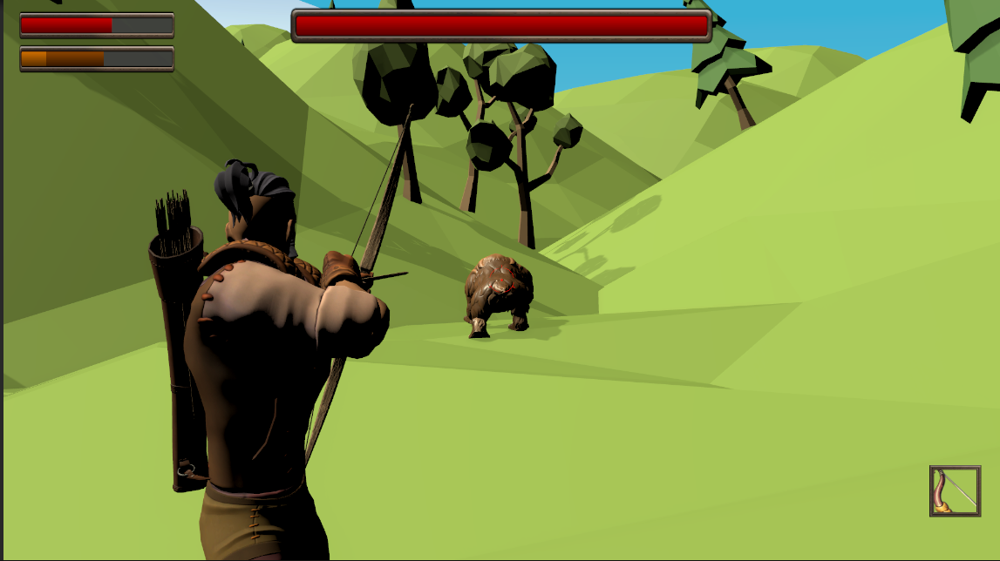
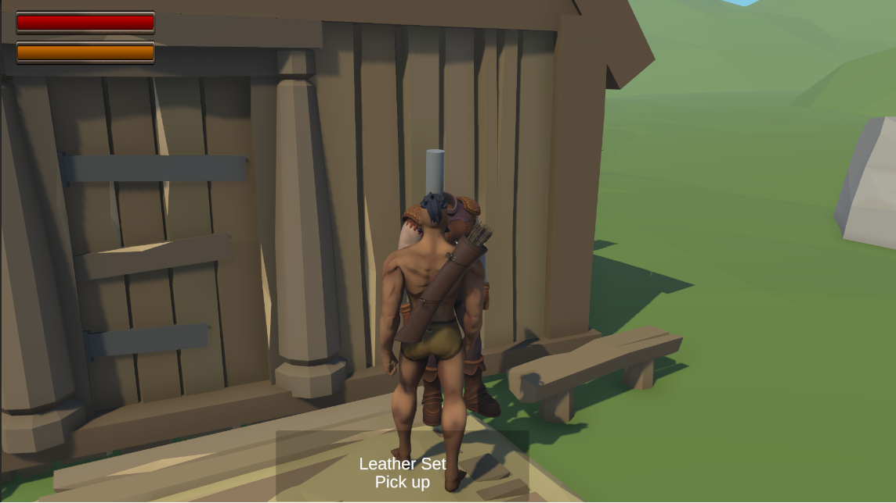
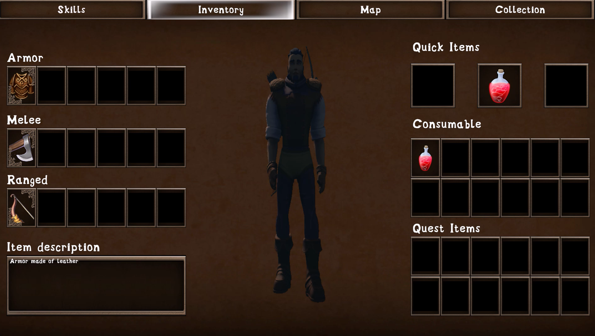

# Vadis Game

## General Description
Example scripts developed as a member of Jelly Pidgeon Studios for medieval roguelike game based on the slavic mythology.

Recently I have implemented player's death feature, improved animations for hp/stamina bar, implemented multi-scene architecture

## Currently Developed Systems
Systems currently developed by me consist of (not all are included in the example code):
- Player's interaction with different objects
- Picking up items and adding them to an inventory
- Inventory with description of every item after pointing it
- Equipment of armors and weapons with a preview in the inventory
- Adding items to quick slots
- Bow managing with usage of Object Pooling for arrows
- Animation Rigging, Changing camera while aiming
- Dependency Injection with Zenject
- Multi-scene Architecture
- Animations for Pefect Aiming feature
- Player Death Management with Restarting Game after death occured
- Melee Fight with block possibility that reduces incoming damage
- Stamina regeneration over time
- UI Animations with DoTween

## Sample Code Description
Example code consist of:
- **New Input System** management
- **Events** implementation
- **Bow Fighting System** with classes responsible for handling different parts of this system - input listening, aiming, rotating toward target, crosshair management, shooting, arrow pooling, losing stamina while aiming
- Some of **UI Inventory slots** management

## Current Progress
### [Demo Movies](https://drive.google.com/drive/u/1/folders/1-9xJ1gSEDy4d149fdS8M07nTynlMtNPo)

### Screenshots
 
 
## Contact
- Developer: [bartosz.pokorski67@gmail.com](mailto:bartosz.pokorski67@gmail.com)
- Studio: [jellypidgeonstudios@gmail.com](mailto:jellypidgeonstudios@gmail.com)

